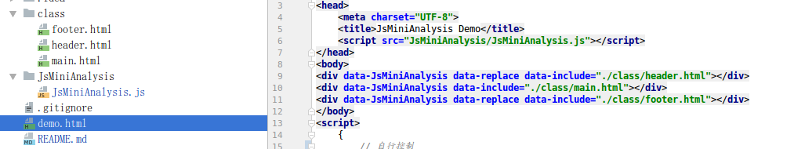
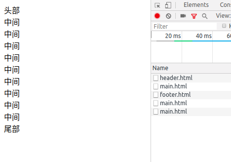

# JsMiniAnalysis

迷你的加载动态加载html框架

## 使用方式

HTML Code

    <!DOCTYPE html>
    <html lang="zh-cn">
    <head>
        <meta charset="UTF-8">
        <title>JsMiniAnalysis Demo</title>
        
    </head>
    <body>
    

    

    

    </body>
    </html>

* 包含 `data-JsMiniAnalysis` 表示该节点为动态加载节点
* 包含 `data-replace` 表示该节点为替换节点，新内容将替换当前节点，否则新内容将放入该节点内部
* 包含 `data-include` 表示新节点内容地址

Javascript

* 自行控制

        let dom = document.querySelectorAll("*[data-JsMiniAnalysis]");
        for (let i = 0; i < dom.length; i++) {
            if (dom.hasOwnProperty(i))
                delete new JsMiniAnalysis({
                    dom: dom[i]
                    , isReplace: true
                    , depth: 3
                    , cb: function () {
                        console.count(i);
                    }
                    , err: console.log
                }).run();
        }

* 自动初始化

        console.time("body");
        // 自动初始化
        JsMiniAnalysis.InitAll(3,function () {
            console.timeEnd("body");
        });

* 自动初始化且使用`POST`请求
    
        let dom = document.body;
        console.time("body");
        delete new JsMiniAnalysis({
            dom: dom
            , isReplace: true
            , depth: 3
            , data: {time:123456}
            , cb: function () {
                console.timeEnd("body");
            }
            , err: console.log
        }).run();

> 参数说明
>
> 1. `dom` 当前节点
>
> 1. `isReplace` 是否是替换节点，同 `data-replace`
>
> 1. `Url` 请求的`URL`，同 `data-include`
>
> 1. `data` 数据，包含该字段则使用 `POST` `JSON` 方式请求数据
>
> 1. `depth` 深度，需要解析几层，默认 `100` 层
>
> 1. `cb` 执行完毕回调函数
>
> 1. `err` 错误回调函数;注意，该函数可能不止调用一次
>

_`JsMiniAnalysis.InitAll` 为全局自动初始化函数，参数为：`depth` 以及 `cb`_

## 效果

源码

> 

效果
> 